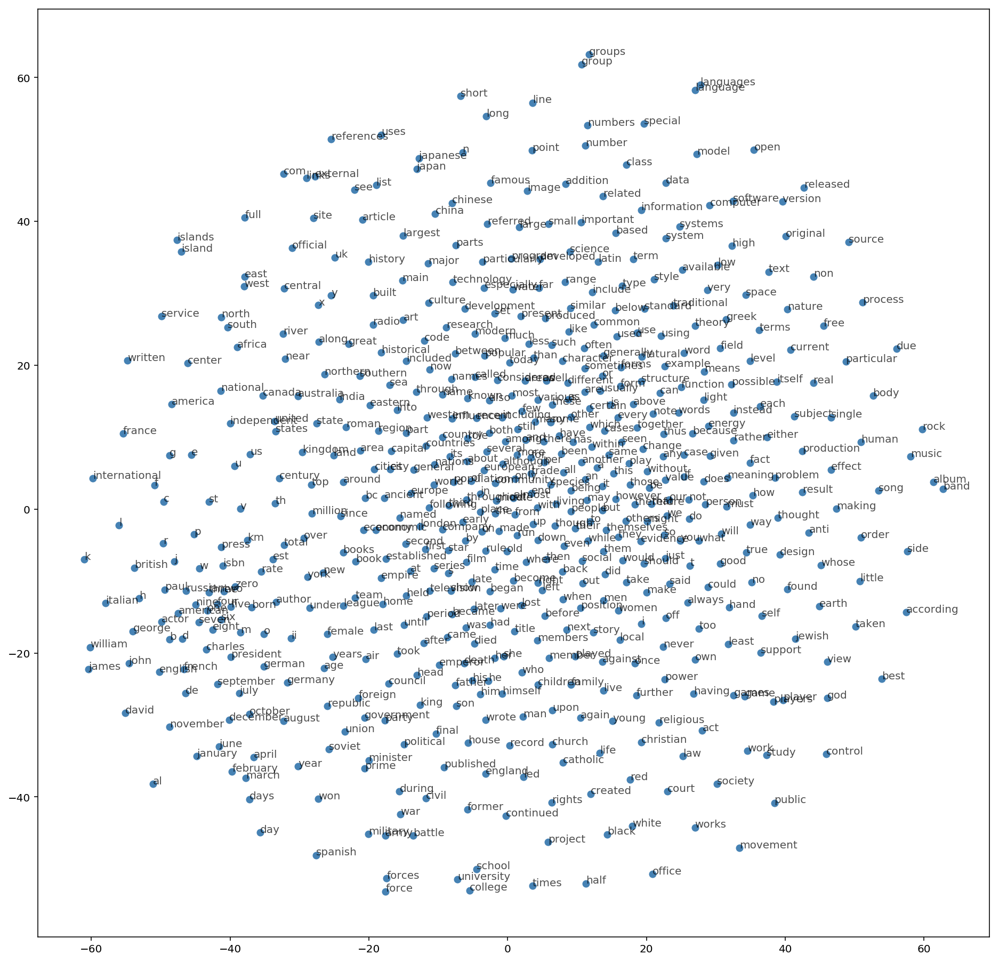
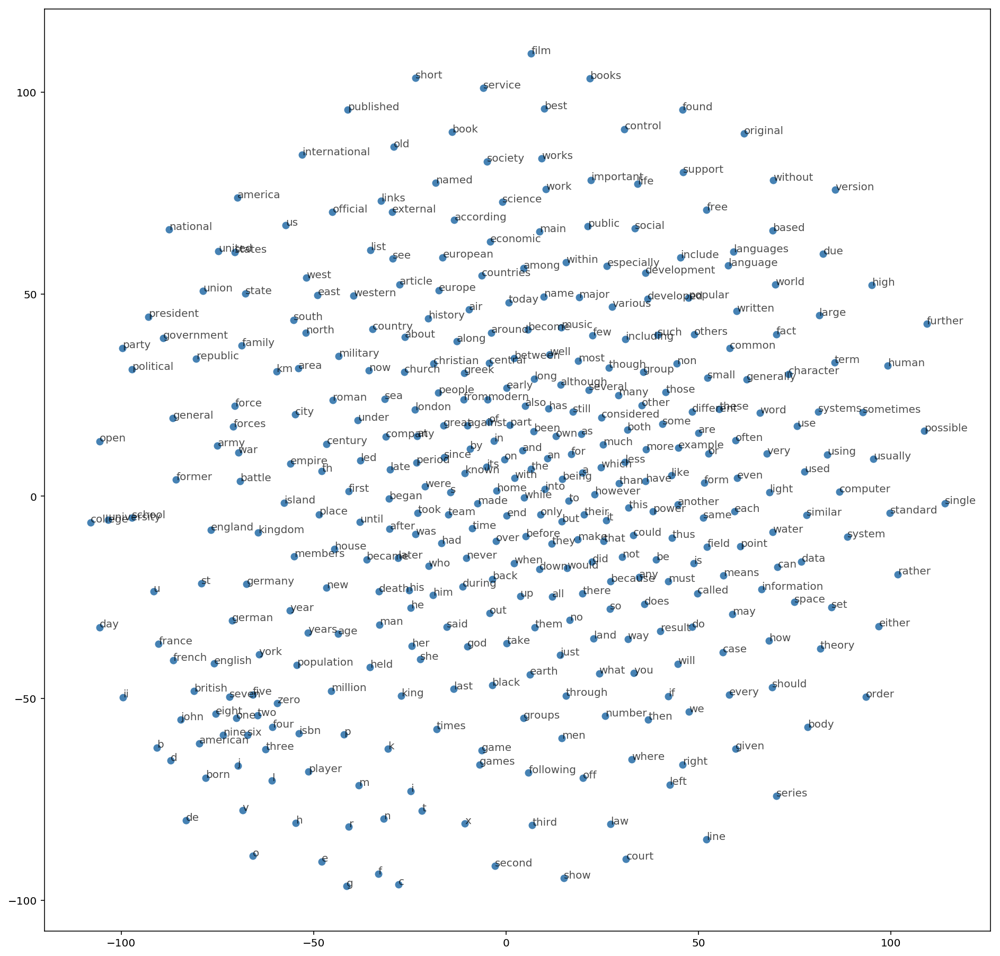

# NLP Word2Vec - PyTorch Skip-Grams, Negative Sampling Implementation  

This model uses PyTorch to implement Word2Vec using the skip-grams and negative sampling architecture 

Below are Word2Vec in T-SNE visualization:

1. Skip-gram T-SNE

2. Negative Sampling T-SNE

There are 3 main parts of this model:

1. **Skip-Grams**: PyTorch Skip-Grams implementation

2. **Negative Sampling**: Implementation to update only subset of weights 

3. **utils**: Preprocess, lookup table implementation

## List of Hyperparameters used:

* Model = **PyTorch Embedding layer model**
* Number of Embeddings - **nuymber of vocabulary** 
* Embedding Dimention - **300**  
* Loss - **NegativeSamplingLoss** 
* Optimizer  = **Adam**  
* Initial Learning Rate = **0.003**
